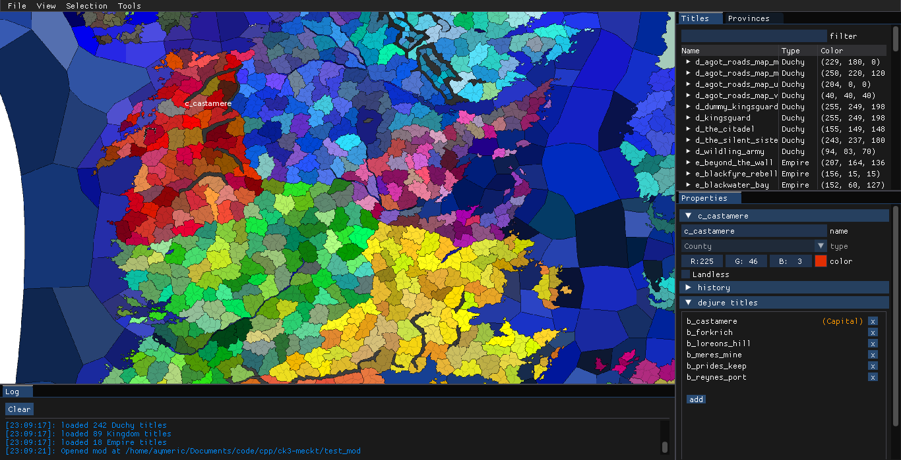
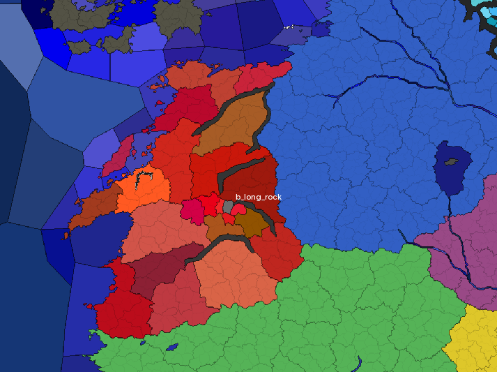
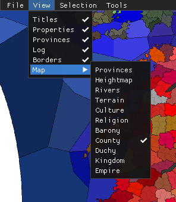

# Meckt - a map editor for Crusader Kings 3.

Meckt is a tool whose goal is making total conversion mod easier and less cumbersome. It includes tools to generate provinces from the provinces image, to create and edit titles using a user interface and a map, to manage the history of titles.

> **Warning:**  
> Please use this tool with caution. Exporting modifications will impact significantly the structure and content of your files.  
> Always ensure you have a **backup of your mod files before exporting** to prevent any unintended changes or data loss.  

## Overview

  

  

## Controls

- **Select Multiple Titles:** `Shift + Left Mouse Button (LMB)`.
- **Unselect One Title:** `Ctrl + Left Mouse Button (LMB)`.

- **Unwrap Title:** `Ctrl + Left Mouse Button (LMB)` on the liege title.
- **Wrap Titles Back:** `Right Mouse Button (RMB)` on one of the vassals.

## Contributing

Contributions to the project are highly appreciated! There are several ways to get involved: you can contribute by reporting any issues you encounter, suggesting new features that could enhance the project, or even by actively participating in the development process through the submission of pull requests.

## Third-Party Libraries

- **Simple and Fast Multimedia Library** (https://www.sfml-dev.org/)
- **Dear ImGui** (https://github.com/ocornut/imgui/)
- **ImGui-SFML** (https://github.com/SFML/imgui-sfml)
- **Backward-cpp** (https://github.com/bombela/backward-cpp)
- **{fmt}** (https://fmt.dev/)
- **Native File Dialog** (https://github.com/mlabbe/nativefiledialog)

## License

This project is licensed under the MIT License - see the [LICENSE](https://raw.githubusercontent.com/Xorrad/ck3-meckt/master/LICENSE) file for details.